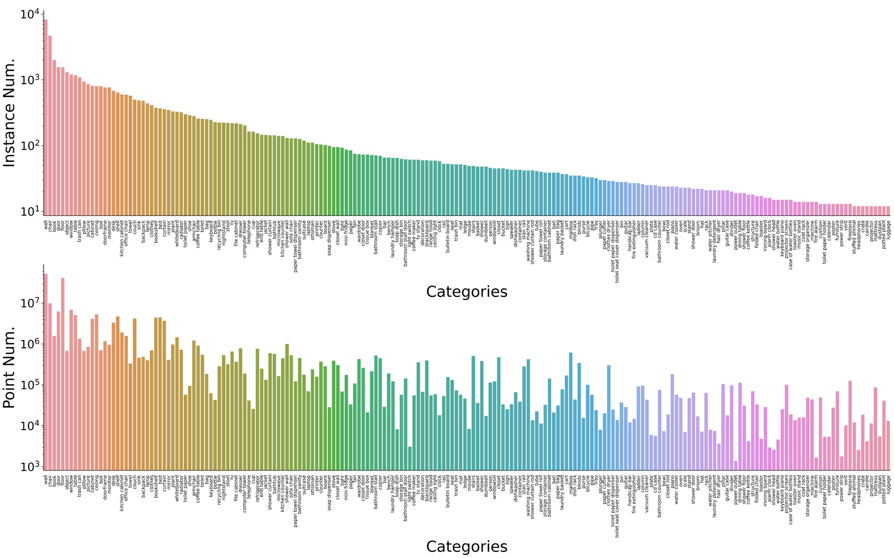

# ScanNet200 Preprocessing Scripts and description 

We provide the preprocessing scripts and benchmark data for the ScanNet200 Benchmark. 
The raw scans and annotations are shared with the original [ScanNet benchmark](http://kaldir.vc.in.tum.de/scannet_benchmark); these scripts provided output semantic and instance labeled meshes according to the ScanNet200 categories. 
The ScanNet scene meshes are surface annotated, where every vertex is described with the raw category id. 
These IDs can be parsed based on the mapping defined in the `scannetv2-labels.combined.tsv`. 

**Important Note:** The `scannetv2-labels.combined.tsv` file was updated with the introduction of the ScanNet200 benchmark, please download the latest version using the script obtained after filling the [Terms of Use form](https://github.com/ScanNet/ScanNet#scannet-data). 


Differences and similarities to the original benchmark
 - The ScanNet200 benchmark evaluates 200 categories, an order of magnitude larger than the original set of 20 classical semantic labels.
 - This new benchmark follows the original _train_/_val_/_test_ scene splits published in this repository, 
 - We presented a further split of the category sets into three sets based on their point and instance frequencies, namely **head**, **common**, and **tail**. The category splits can be found in `scannet200_split.py` file
 - The raw annotations in the training set containing 550 distinct categories, many of which appear only once, and were filtered to produce the large-vocabulary, challenging ScanNet200 setting. The mapping of annotation category IDs to ScanNet200 valid categories can be found in `scannet200_constants.py`.
 - This larger vocabulary includes a strong natural imbalance and diversity for evaluating modern 3D scene understanding methods in a challenging scenario.   



We provide scripts for preprocessing and parsing the scene meshes to semantically and instance labeled meshes in `preprocess_scannet200.py`. 
Additionally, helper functions such as mesh voxelization can be found in `utils.py`

### Running the preprocessing

The scripts are developed and tested with Python 3, and basic libraries like _pandas_ and _plyfile_ are expected to be installed. 
Additionally, we rely on _trimesh_ and _MinkowskiEngine_ for uniform mesh voxelization, but these libraries are not strictly necessary

For the installation of all required libraries

```
conda create -n scannet200 python=3.8
pip install -r requirements.txt
```

For the optional MinkowskiEngine required in the voxelization script, please refer to the [installation guide](https://github.com/NVIDIA/MinkowskiEngine#anaconda) corresponding the specific GPU version. 


The preprocessing can be started with 

```
python --dataset_root <SCANNET_ROOT_FOLDER> 
       --output_root <OUTPUT_ROOT_FOLDER> 
       --label_map_file <PATH_TO_MAPPING_TSV_FILE>
```

Where script options:
```
--dataset_root:       
          Path to the ScanNet dataset containing scene folders
--output_root:       
          Output path where train/val folders will be located
--label_map_file:       
          path to the updated scannetv2-labels.combined.tsv
--num_workers:       
          The number of parallel workers for multiprocessing
          default=4
--train_val_splits_path:
          Where the txt files with the train/val splits live    
          default='../../Tasks/Benchmark'
```
